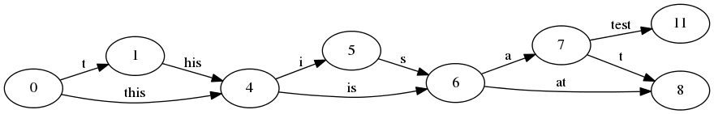
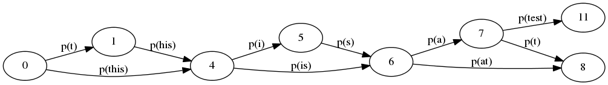
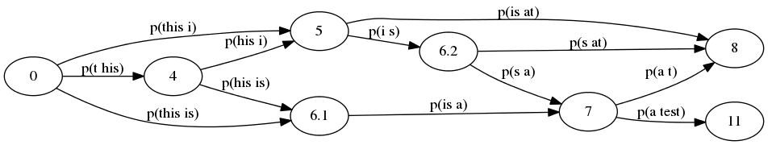

# Графы и поиск кратчайшего пути

## Представление графов

Абстрактно, граф это пара множеств: вершин (V) и ребер (E) — `G = (V, E)`.

В программе его можно представить в виде:

- матрицы смежности (VxV)
- списков смежности (для каждой вершины список ее ребер)
- матрицы инциденций (VxE)
- списка ребер (E)

На практике, из-за компакности и скорости поиска соседей, основным представлением является списки смежности.
Также в некоторых алгоритмах используется матрица смежности, хотя для разреженных графов большого размера это крайне не эффективно.


## Поиск кратчайшего пути

В зависимости от типа графа (направленный/ненаправленный, взвешенный/невзвешенный, направленный ациклический, содержащий отрицательные веса), а также типа цели (вершина-вершина, вершина-все другие вершины или между всеми вершинами) применяются разные алгоритмы, которые имеют различную сложность.

**Направленный ациклический граф (directed acyclic graph, DAG)** — один из основных типов графов, применяемых на практике. Например, он может представлять граф зависимостей в программе: иерархии классов, библиотек/пакетов для сборки, одних операций от других. Для такого графа задача может быть решена с использованием алгоритмы топологической сортировки и ДП.

## Топологическая сортировка

Топологическая сортировка — это частичный порядок вершин DAG'а, при котором вершина-потомок всегда прешествует вершине-предку.

Пример графа и топологической сортировки его вершин:


```
6 4 5 3 2 1 8 7 или 6 4 5 2 3 1 8 7 или 8 7 6 4 5 3 2 1 или 8 7 6 4 5 2 3 1
```

Алгоритм:

1. Начиная с любой вершины графы произвести обход в глубину (DFS) до тех пор, пока не найдем вершину, у которой нет или не осталось не просмотренных потомков.
2. При этом каждую посещенную вершину добавлять ко множеству посещенных.
3. Добавить вершину без потомков в массив отсортированных вершин.
4. Когда все вершины, начиная с первой выбранной, просмотренны, если в графе еще остались не посещенные вершины, повторить алгоритм для них.

```
(defstruct (node (:conc-name nil))
  id children)

(defclass graph ()
  ((nodes :initarg :nodes :initform (make-hash-table) :accessor nodes)))

(defun topo-sort (graph &optional
                        ;; nodes that were not visited - initially, all nodes
                        (unvisited (copy-hash-table (nodes graph)))
                        (rez (make-array 0 :adjustable t :fill-pointer t))
                        (node (block take-first
                                (maphash (lambda (k v)
                                           (return-from take-first v))
                                         unvisited))
                              ;; additional value showing if the argument was provided
                              recursive-p))
  (remhash (id node) unvisited)
  (dolist (node-weight (children node))
    (let ((child (first node-weight) ))
      (when (gethash (id child) unvisited)
        (topo-sort graph unvisited rez child))))
  (vector-push-extend node rez)
  (when (and (not recursive-p)
             (> (hash-table-count unvisited) 0))
    ;; some more unvisited nodes remain
    (topo-sort graph unvisited rez))
  rez)
```


## ДП для поиска кратчайшего пути

Алгоритм ДП для поиска кратчайшего пути в DAG'е — это обход вершин в порядке топологической сортировки.

Более того, любую задачу, решаемую методом ДП, можно привести к задаче поиска кратчайшего пути на DAG'е. Единственная сложность — это правильно выбрать вершины и веса ребер между ними. Эта формулировка задачи представляет (визуальную) альтернативу к записи рекурентного соотношения.

Пример — задача о разбиении строки.

Вариант 1: без учета вероятностей слов



Вариант 2: выбор оптимального решения на основе вероятности отдельных слов



Вариант 3: выбор оптимального решения на основе вероятности пар слов (биграм)




## Литература

- http://xn--90abr5b.xn--p1ai/exams/%D1%81%D0%B0%D0%BE%D0%B4/6.htm
- https://en.wikipedia.org/wiki/Shortest_path_problem
- https://habrahabr.ru/post/100953/
- https://www.cs.usfca.edu/~galles/visualization/TopoSortDFS.html
